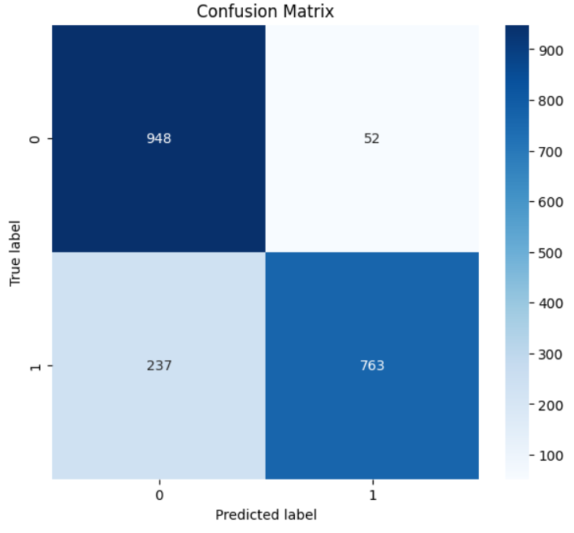
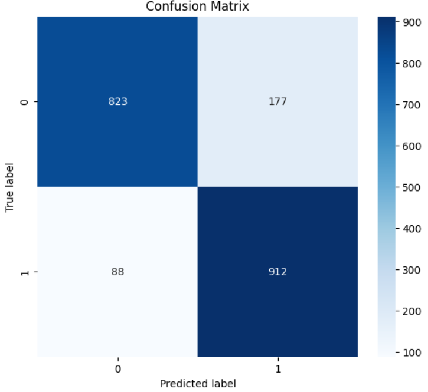
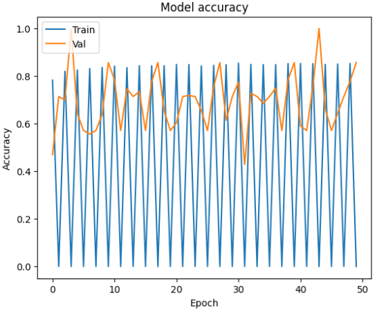
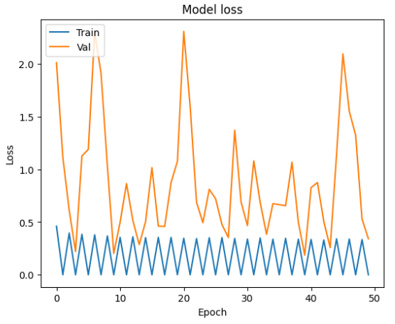
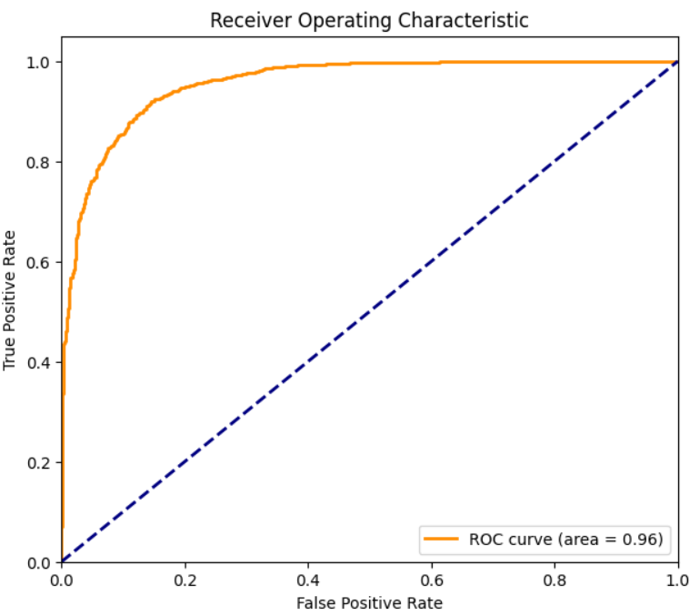
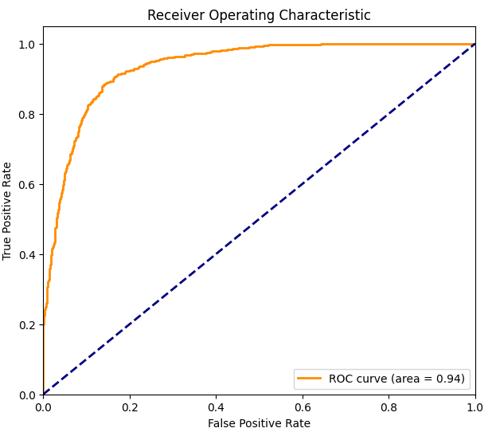

# Melanoma Detection Using Deep Learning

This repository contains the implementation of a binary classification system to detect melanoma from dermatoscopic images using deep learning. The project utilizes transfer learning with pre-trained models and an ensemble approach to enhance classification accuracy.

## Project Overview

Melanoma, a dangerous form of skin cancer, can be effectively treated if detected early. This project aims to build a deep learning model that accurately classifies dermatoscopic images as benign or malignant, aiding in early detection efforts.

## Dataset Structure

The dataset is organized into training and testing subsets, each containing 'Benign' and 'Malignant' classes:
melanoma-cancer-dataset/
├── train/
│ ├── Benign/
│ └── Malignant/
└── test/
├── Benign/
└── Malignant/

## Methodology

1. **Data Preprocessing:**
   - Utilized Keras' `ImageDataGenerator` for image augmentation.
   - Prepared training, validation, and test datasets.

2. **Model Training:**
   - **VGG16 Model**: Applied transfer learning using VGG16 as the base model.
   - **ResNet50 Model**: Implemented ResNet50 in a similar fashion for comparison.

3. **Evaluation:**
   - Evaluated both models using confusion matrices.

4. **Ensemble Approach:**
   - Combined predictions from VGG16 and ResNet50 to improve the final performance.

## Results

  
   
  <em>Figure 1: Confusion Matrix by VGG16</em>

  
   
  <em>Figure 2: Confusion Matrix by ResNET50</em>

  
   
  <em>Figure 3: ResNET Performance</em>

  
   
  <em>Figure 4: ResNET Loss</em>

  
   
  <em>Figure 5: VGG 16 ROC Curve</em>

  
   
  <em>Figure 6: ResNET ROC Curve</em>

